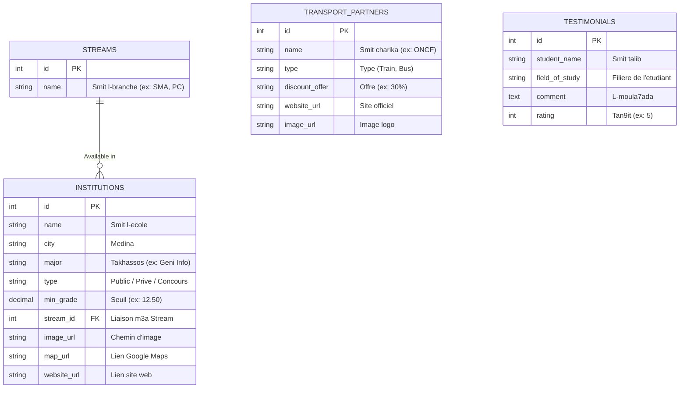

# Diagramme de Structure de Données (Data Structure Diagram)

Hada houwa l-diagramme li kaybayen l-3ala9at bin l-entities f l-projet dyalk.

```mermaid
erDiagram
    %% Table pour les branches du Bac (e.g. Sc Math, SVT)
    STREAMS {
        int id PK
        string name "Smit l-branche (ex: SMA, PC)"
    }

    %% Table pour les Écoles et Universités
    INSTITUTIONS {
        int id PK
        string name "Smit l-ecole"
        string city "Medina"
        string major "Takhassos (ex: Geni Info)"
        string type "Public / Prive / Concours"
        decimal min_grade "Seuil (ex: 12.50)"
        int stream_id FK "Liaison m3a Stream"
        string image_url "Chemin d'image"
        string map_url "Lien Google Maps"
        string website_url "Lien site web"
    }

    %% Table pour les Partenaires de Transport (Slide)
    TRANSPORT_PARTNERS {
        int id PK
        string name "Smit charika (ex: ONCF)"
        string type "Type (Train, Bus)"
        string discount_offer "Offre (ex: 30%)"
        string website_url "Site officiel"
        string image_url "Image logo"
    }

    %% Table pour les Témoignages (Reviews)
    TESTIMONIALS {
        int id PK
        string student_name "Smit talib"
        string field_of_study "Filiere de l'etudiant"
        text comment "L-moula7ada"
        int rating "Tan9it (ex: 5)"
    }

    %% Relations
    STREAMS ||--o{ INSTITUTIONS : "Available in"
```
