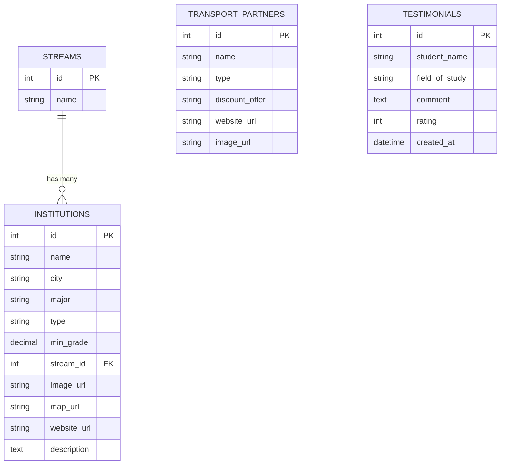

# Database Design for Eco Maroc

## Entity Relationship Diagram (ERD)

## How to use
1. Open **phpMyAdmin**.
2. Create a new database named `eco_maroc` (if not exists).
3. Import the `database.sql` file generated in your project folder.
